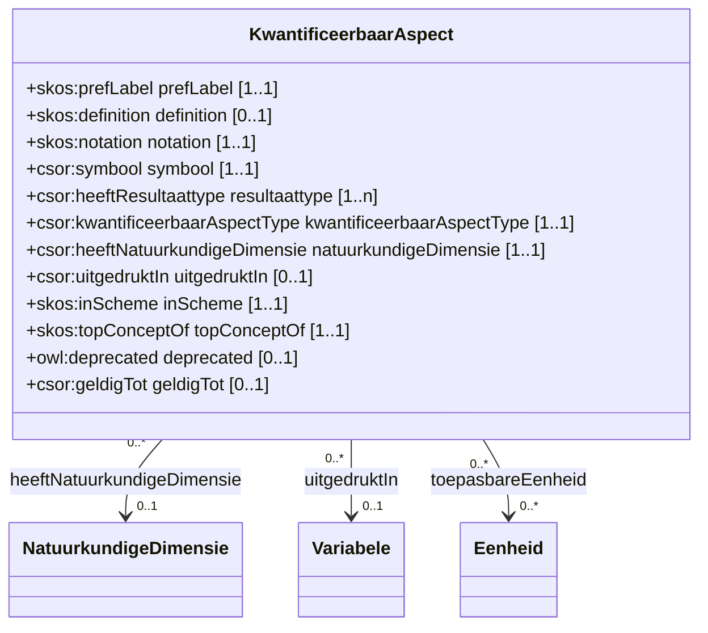

# Kwantificeerbaar Aspect

Een kwantificeerbaar aspect is een meetbaar aspect van een parameter met een numerieke waarde.
Het duidt aan wat de interpretatie is van de numerieke waarde van een meting binnen een natuurkundige dimensie.

## Overzicht diagram

## Eigenschappen

De klasse `csor:KwantificeerbaarAspect` heeft de volgende eigenschappen:

| Eigenschap | URI | Type | Cardinaliteit | Beschrijving |
| :--- | :--- | :--- | :--- | :--- |
| **prefLabel** | `skos:prefLabel` | `xsd:string` | 1..1 | De voorkeursnaam van het kwantificeerbaar aspect. |
| **definition** | `skos:definition` | `xsd:string` | 0..1 | Een tekstuele definitie. |
| **notation** | `skos:notation` | `xsd:string` | 0..1 | Een unieke notatie. |
| **symbool** | `csor:symbool` | `xsd:string` | 0..1 | Symbool dat gebruikt wordt om het concept weer te geven. |
| **resultaattype** | `csor:heeftResultaattype` | `csor:ResultaatType` | 0..1 | De link met het resultaattype. |
| **kwantificeerbaarAspectType** | `csor:kwantificeerbaarAspectType` | `xsd:string` | 0..1 | Bijv. INDIVIDUELE_OBSERVATIE of VRACHT. |
| **natuurkundigeDimensie** | `csor:heeftNatuurkundigeDimensie` | `csor:NatuurkundigeDimensie` | 0..1 | De gekoppelde natuurkundige dimensie. |
| **uitgedruktIn** | `csor:uitgedruktIn` | `csor:Variabele` | 0..1 | De variabele waarin het resultaat uitgedrukt wordt. |
| **toepasbareEenheid** | `csor:toepasbareEenheid` | `csor:Eenheid` | 0..* | Eenheid die toepasbaar is voor dit aspect. |
| **inScheme** | `skos:inScheme` | `skos:ConceptScheme` | 1..1 | Het conceptschema waartoe dit concept behoort. |
| **topConceptOf** | `skos:topConceptOf` | `skos:ConceptScheme` | 0..1 | Geeft aan of dit een topconcept is. |
| **deprecated** | `owl:deprecated` | `xsd:boolean` | 0..1 | Geeft aan of het concept verouderd is. |
| **geldigTot** | `csor:geldigTot` | `xsd:date` | 0..1 | De datum tot wanneer het concept geldig is. |

## Voorbeelden

Een overzicht van voorbeelden voor deze codelijst is te vinden op de [voorbeelden pagina](../examples/kwantificeerbaaraspect.md).

## RDF Data

De brondata is beschikbaar in verschillende formaten:
- [Turtle](../../codelijst-project/output/be/vlaanderen/omgeving/data/id/conceptscheme/csor/kwantificeerbaaraspect/kwantificeerbaaraspect.ttl)
