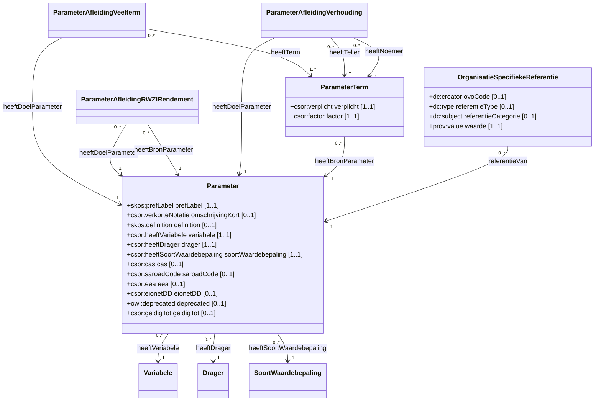

# Parameter

Een parameter specificeert een soort uitspraak over een variabele.
Het koppelt een variabele aan een medium waarin de observatie gebeurt (drager) en de wijze waarop de observatie gebeurt (het soort waardebepaling).

Een parameter beschrijft meer specifiek waarover een uitspraak wordt gedaan d.m.v extra context en constraints.

## Overzicht diagram

## Eigenschappen

### Parameter

De klasse `csor:Parameter` heeft de volgende eigenschappen:

| Eigenschap | URI | Type | Cardinaliteit | Beschrijving |
| :--- | :--- | :--- | :--- | :--- |
| **prefLabel** | `skos:prefLabel` | `xsd:string` | 1..1 | De volledige naam van de parameter. |
| **omschrijvingKort** | `csor:verkorteNotatie` | `xsd:string` | 0..1 | Verkorte omschrijving. |
| **definition** | `skos:definition` | `xsd:string` | 0..1 | Definitie van de parameter. |
| **variabele** | `csor:heeftVariabele` | `csor:Variabele` | 1..1 | De gekoppelde variabele. |
| **drager** | `csor:heeftDrager` | `csor:Drager` | 1..1 | De gekoppelde drager. |
| **soortWaardebepaling** | `csor:heeftSoortWaardebepaling` | `csor:SoortWaardebepaling` | 1..1 | De gekoppelde soort waardebepaling. |
| **cas** | `csor:cas` | `xsd:string` | 0..1 | CAS-code. |
| **saroadCode** | `csor:saroadCode` | `xsd:string` | 0..1 | Saroad-code. |
| **eea** | `csor:eea` | `xsd:string` | 0..1 | EEA-code. |
| **eionetDD** | `csor:eionetDD` | `xsd:string` | 0..1 | EionetDD-code. |
| **deprecated** | `owl:deprecated` | `xsd:boolean` | 0..1 | Verouderd status. |
| **geldigTot** | `csor:geldigTot` | `xsd:date` | 0..1 | Einddatum geldigheid. |

### ParameterAfleidingVeelterm

Dient om een parameter af te leiden als een veelterm van andere parameters.

| Eigenschap | URI | Type | Cardinaliteit | Beschrijving |
| :--- | :--- | :--- | :--- | :--- |
| **voorParameter** | `csor:heeftDoelParameter` | `csor:Parameter` | 1..1 | De afgeleide parameter. |
| **term** | `csor:heeftTerm` | `csor:ParameterTerm` | 1..* | De termen waaruit de veelterm bestaat. |

### ParameterAfleidingRWZIRendement

Dient om een parameter af te leiden op basis van RWZI-rendement.

| Eigenschap | URI | Type | Cardinaliteit | Beschrijving |
| :--- | :--- | :--- | :--- | :--- |
| **voorParameter** | `csor:heeftDoelParameter` | `csor:Parameter` | 1..1 | De afgeleide parameter. |
| **rendementParameter** | `csor:heeftBronParameter` | `csor:Parameter` | 1..1 | De bronparameter voor de berekening. |

### ParameterAfleidingVerhouding

Dient om een parameter af te leiden als de verhouding tussen twee andere parameters.

| Eigenschap | URI | Type | Cardinaliteit | Beschrijving |
| :--- | :--- | :--- | :--- | :--- |
| **voorParameter** | `csor:heeftDoelParameter` | `csor:Parameter` | 1..1 | De afgeleide parameter. |
| **teller** | `csor:heeftTeller` | `csor:ParameterTerm` | 1..1 | De parameter in de teller. |
| **noemer** | `csor:heeftNoemer` | `csor:ParameterTerm` | 1..1 | De parameter in de noemer. |

### ParameterTerm

Een bouwblok voor een veelterm afleiding.

| Eigenschap | URI | Type | Cardinaliteit | Beschrijving |
| :--- | :--- | :--- | :--- | :--- |
| **veeltermParameter** | `csor:heeftBronParameter` | `csor:Parameter` | 1..1 | De bronparameter. |
| **verplicht** | `csor:verplicht` | `xsd:boolean` | 1..1 | Is deze term verplicht? |
| **factor** | `csor:factor` | `xsd:decimal` | 1..1 | De factor voor deze term. |

### OrganisatieSpecifiekeReferentie

Koppelt organisatie-specifieke metadata aan een parameter.

| Eigenschap | URI | Type | Cardinaliteit | Beschrijving |
| :--- | :--- | :--- | :--- | :--- |
| **referentieVan** | `dct:references` | `csor:Parameter` | 1..1 | De parameter waarnaar verwezen wordt. |
| **ovoCode** | `dc:creator` | `xsd:string` | 0..1 | De OVO-code van de organisatie. |
| **ovoCodeIRI** | `dct:creator` | `rdfs:Resource` | 0..1 | De IRI van de organisatie. |
| **referentieType** | `dc:type` | `xsd:string` | 0..1 | Het type referentie. |
| **referentieCategorie** | `dc:subject` | `xsd:string` | 0..1 | De categorie van de referentie. |
| **waarde** | `prov:value` | `xsd:string` | 1..1 | De specifieke waarde/code binnen de organisatie. |

## Voorbeelden

Een overzicht van voorbeelden voor deze codelijst is te vinden op de [voorbeelden pagina](../examples/parameter.md).

## RDF Data

De brondata is beschikbaar in verschillende formaten:
- [Turtle](../../codelijst-project/output/be/vlaanderen/omgeving/data/id/conceptscheme/csor/parameter/parameter.ttl)
