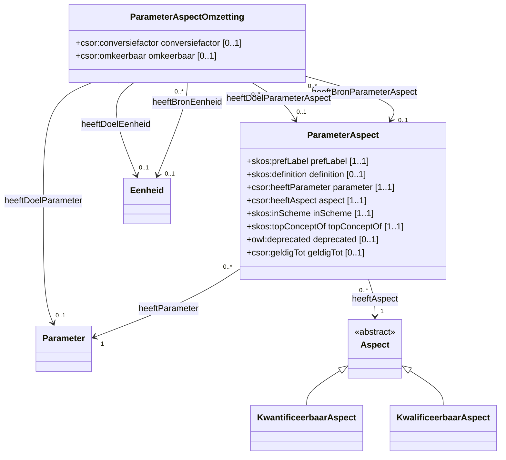

# ParameterAspect

Een parameteraspect linkt een parameter aan een kwantificeerbaar of kwalificeerbaar aspect waarin de parameter uitgedrukt/vastgelegd kan worden.
Het linkt een parameter aan een observeerbaar aspect waarin de waarde van de parameter kan vastgelegd worden.

## Overzicht diagram

## Eigenschappen

### ParameterAspect

De klasse `csor:ParameterAspect` heeft de volgende eigenschappen:

| Eigenschap | URI | Type | Cardinaliteit | Beschrijving |
| :--- | :--- | :--- | :--- | :--- |
| **prefLabel** | `skos:prefLabel` | `xsd:string` | 1..1 | De voorkeursnaam van het parameteraspect. |
| **definition** | `skos:definition` | `xsd:string` | 0..1 | Definitie van het parameteraspect. |
| **parameter** | `csor:heeftParameter` | `csor:Parameter` | 1..1 | De gekoppelde parameter. |
| **aspect** | `csor:heeftAspect` | `csor:Aspect` | 1..1 | Het gekoppelde aspect (`csor:KwantificeerbaarAspect` of `csor:KwalificeerbaarAspect`). |
| **deprecated** | `owl:deprecated` | `xsd:boolean` | 0..1 | Geeft aan of het concept verouderd is. |
| **geldigTot** | `csor:geldigTot` | `xsd:date` | 0..1 | Einddatum van geldigheid. |

### ParameterAspectOmzetting

De klasse `csor:ParameterAspectOmzetting` definieert de omzetting tussen twee parameteraspecten:

| Eigenschap | URI | Type | Cardinaliteit | Beschrijving |
| :--- | :--- | :--- | :--- | :--- |
| **omzettingVoorParameter** | `csor:heeftDoelParameter` | `csor:Parameter` | 0..1 | De parameter waarvoor de omzetting geldt. |
| **parameterAspectVan** | `csor:heeftBronParameterAspect` | `csor:ParameterAspect` | 0..1 | Het bron-parameteraspect. |
| **eenheidVan** | `csor:heeftBronEenheid` | `csor:Eenheid` | 0..1 | De bron-eenheid. |
| **parameterAspectNaar** | `csor:heeftDoelParameterAspect` | `csor:ParameterAspect` | 0..1 | Het doel-parameteraspect. |
| **eenheidNaar** | `csor:heeftDoelEenheid` | `csor:Eenheid` | 0..1 | De doel-eenheid. |
| **conversiefactor** | `csor:conversiefactor` | `xsd:decimal` | 0..1 | De factor voor de omzetting. |
| **omkeerbaar** | `csor:omkeerbaar` | `xsd:boolean` | 0..1 | Geeft aan of de omzetting omkeerbaar is. |

## Voorbeelden

Een overzicht van voorbeelden voor deze codelijst is te vinden op de [voorbeelden pagina](../examples/parameteraspect.md).

## RDF Data

De brondata is beschikbaar in verschillende formaten:
- [Turtle](../../codelijst-project/output/be/vlaanderen/omgeving/data/id/conceptscheme/csor/parameteraspect/parameteraspect.ttl)
