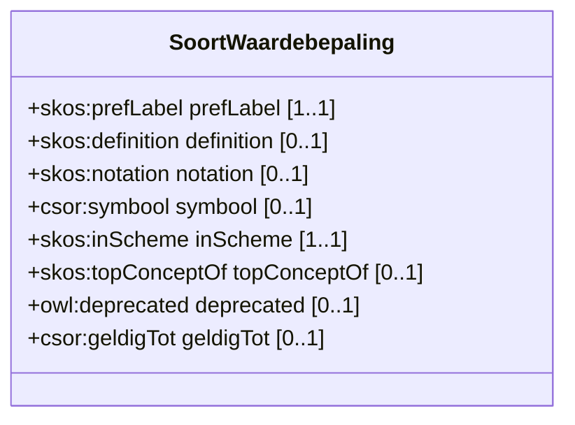

# Soort Waardebepaling

De wijze waarop de observatie of waardebepaling gebeurt.

## Overzicht diagram

## Eigenschappen

De klasse `csor:SoortWaardebepaling` heeft de volgende eigenschappen:

| Eigenschap | URI | Type | Cardinaliteit | Beschrijving |
| :--- | :--- | :--- | :--- | :--- |
| **prefLabel** | `skos:prefLabel` | `xsd:string` | 1..1 | De voorkeursnaam van de soort waardebepaling. |
| **definition** | `skos:definition` | `xsd:string` | 0..1 | Een tekstuele definitie. |
| **notation** | `skos:notation` | `xsd:string` | 0..1 | Een unieke notatie. |
| **symbool** | `csor:symbool` | `xsd:string` | 0..1 | Symbool dat gebruikt wordt om het concept weer te geven. |
| **inScheme** | `skos:inScheme` | `skos:ConceptScheme` | 1..1 | Het conceptschema waartoe dit concept behoort. |
| **topConceptOf** | `skos:topConceptOf` | `skos:ConceptScheme` | 0..1 | Geeft aan of dit een topconcept is. |
| **deprecated** | `owl:deprecated` | `xsd:boolean` | 0..1 | Geeft aan of het concept verouderd is. |
| **geldigTot** | `csor:geldigTot` | `xsd:date` | 0..1 | De datum tot wanneer het concept geldig is. |

## Voorbeelden

Een overzicht van voorbeelden voor deze codelijst is te vinden op de [voorbeelden pagina](../examples/soortwaardebepaling.md).

## RDF Data

De brondata is beschikbaar in verschillende formaten:
- [Turtle](../../codelijst-project/output/be/vlaanderen/omgeving/data/id/conceptscheme/csor/soortwaardebepaling/soortwaardebepaling.ttl)
