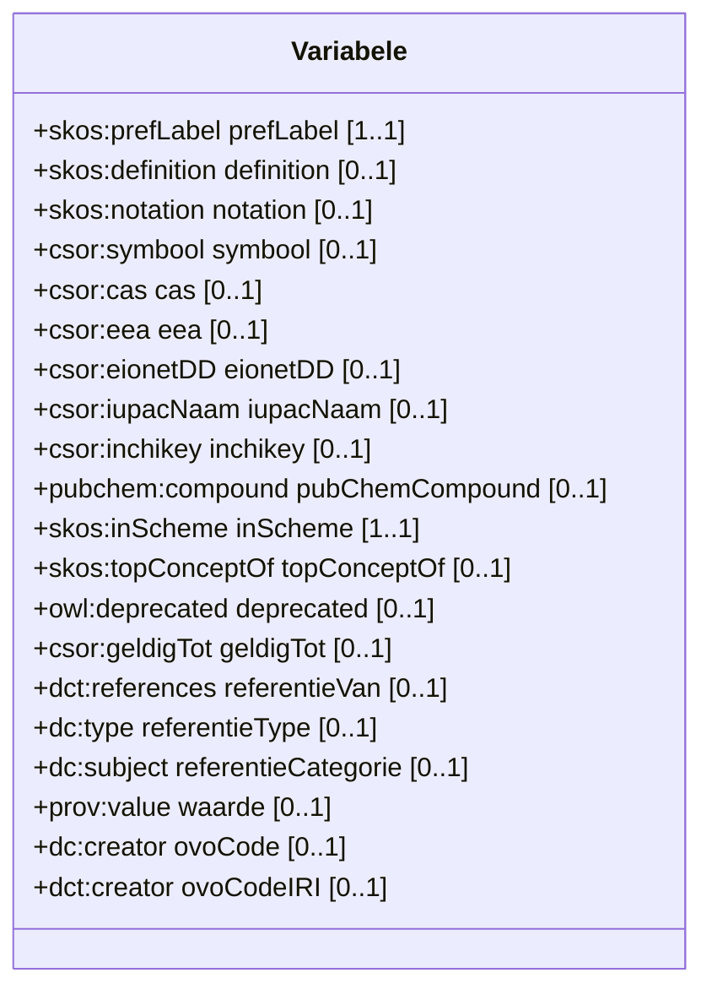

# Variabele

Een variabele beschrijft waarover een uitspraak gebeurt.
Een variabele is een kenmerk dat geobserveerd kan worden, los van de context waarin de obeservatie gebeurt, hoe de observatie gebeurt of hoe de waarde van de observatie wordt vastgelegd.

## Overzicht diagram

## Eigenschappen

De klasse `csor:Variabele` heeft de volgende eigenschappen:

| Eigenschap | URI | Type | Cardinaliteit | Beschrijving |
| :--- | :--- | :--- | :--- | :--- |
| **prefLabel** | `skos:prefLabel` | `xsd:string` | 1..1 | De voorkeursnaam van de variabele. |
| **definition** | `skos:definition` | `xsd:string` | 0..1 | Een tekstuele definitie van de variabele. |
| **notation** | `skos:notation` | `xsd:string` | 0..1 | Een unieke notatie voor de variabele. |
| **symbool** | `csor:symbool` | `xsd:string` | 0..1 | Symbool dat gebruikt wordt om het concept weer te geven. |
| **cas** | `csor:cas` | `xsd:string` | 0..1 | CAS-code gekoppeld aan de variabele. |
| **eea** | `csor:eea` | `xsd:string` | 0..1 | EEA-code gekoppeld aan de variabele. |
| **eionetDD** | `csor:eionetDD` | `xsd:string` | 0..1 | EionetDD-code gekoppeld aan de variabele. |
| **iupacNaam** | `csor:iupacNaam` | `xsd:string` | 0..1 | IUPAC naam voor chemische stoffen. |
| **inchikey** | `csor:inchikey` | `xsd:string` | 0..1 | InChIKey identificatiecode voor chemische stoffen. |
| **pubChemCompound** | `pubchem:compound` | `xsd:anyURI` | 0..1 | Link naar de PubChem Compound. |
| **inScheme** | `skos:inScheme` | `skos:ConceptScheme` | 1..1 | Het conceptschema waartoe de variabele behoort. |
| **topConceptOf** | `skos:topConceptOf` | `skos:ConceptScheme` | 0..1 | Geeft aan of dit een topconcept is. |
| **deprecated** | `owl:deprecated` | `xsd:boolean` | 0..1 | Geeft aan of de variabele verouderd is. |
| **geldigTot** | `csor:geldigTot` | `xsd:date` | 0..1 | De datum tot wanneer de variabele geldig is. |
| **referentieVan** | `dct:references` | `xsd:anyURI` | 0..1 | Referentie naar een extern concept. |
| **referentieType** | `dc:type` | `xsd:string` | 0..1 | Type van de referentie. |
| **referentieCategorie** | `dc:subject` | `xsd:string` | 0..1 | Categorie van de referentie. |
| **waarde** | `prov:value` | `xsd:string` | 0..1 | Waarde geassocieerd met de variabele. |
| **ovoCode** | `dc:creator` | `xsd:string` | 0..1 | OVO-code van de creator. |
| **ovoCodeIRI** | `dct:creator` | `xsd:anyURI` | 0..1 | IRI van de creator. |

## Voorbeelden

Een overzicht van voorbeelden voor deze codelijst is te vinden op de [voorbeelden pagina](../examples/variabele.md).

## RDF Data

De brondata is beschikbaar in verschillende formaten:
- [Turtle](../../codelijst-project/output/be/vlaanderen/omgeving/data/id/conceptscheme/csor/variabele/variabele.ttl)
