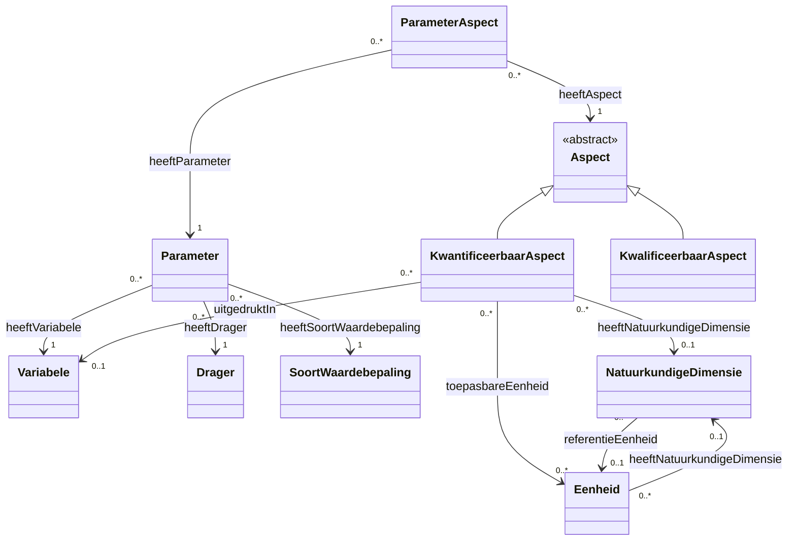

# Codelijsten Overzicht CSOR

## Abstract

Deze documentatie biedt een overzicht van de codelijsten die gezamenlijk worden beheerd in het CSO Register (CSOR). Het beschrijft de kernconcepten zoals dragers, variabelen, parameters en eenheden, evenals hun onderlinge relaties en beperkingen. De documentatie is bedoeld om inzicht te geven in de structuur en samenhang van de data, ondersteund door een gemeenschappelijke ontologie en visuele diagrammen.

## Gebruikte prefixen (namespaces)

Onderstaande tabel geeft een overzicht van de gebruikte prefixen en hun bijbehorende namespaces, zoals gebruikt in de documentatie:

| Prefix | Namespace URI |
| :--- | :--- |
| **csor** | `https://data.omgeving.vlaanderen.be/ns/csor#` |
| **csor-constraints** | `https://data.omgeving.vlaanderen.be/ns/csor-constraints#` |
| **dc** | `http://purl.org/dc/elements/1.1/` |
| **dct** | `http://purl.org/dc/terms/` |
| **iadopt** | `https://w3id.org/iadopt/ont/` |
| **owl** | `http://www.w3.org/2002/07/owl#` |
| **prov** | `http://www.w3.org/ns/prov#` |
| **pubChem** | `https://pubchem.ncbi.nlm.nih.gov/rest/rdf/` |
| **qudt** | `http://qudt.org/schema/qudt/` |
| **rdf** | `http://www.w3.org/1999/02/22-rdf-syntax-ns#` |
| **rdfs** | `http://www.w3.org/2000/01/rdf-schema#` |
| **sh** | `http://www.w3.org/ns/shacl#` |
| **skos** | `http://www.w3.org/2004/02/skos/core#` |
| **xsd** | `http://www.w3.org/2001/XMLSchema#` |

## Globaal Overzicht

Onderstaand diagram toont de onderlinge relaties tussen de verschillende codelijsten:

## Codelijsten

Dit is een overzicht van de codelijsten die gezamenlijk beheerd worden in het cso register.

| Codelijst | Beschrijving | URI | Status |
| :--- | :--- | :--- | :--- |
| [Variabele](codelijsten/variabele.md) | Conceptschema voor variabelen. Een variabele beschrijft waarover een uitspraak gebeurt. | https://data.omgeving.vlaanderen.be/id/conceptscheme/csor/variabele | Gedocumenteerd |
| [Drager](codelijsten/drager.md) | Conceptschema voor dragers. Een drager beschrijft een medium waarin een variabele geobserveerd kan worden. | https://data.omgeving.vlaanderen.be/id/conceptscheme/csor/drager | Gedocumenteerd |
| [Soortwaardebepaling](codelijsten/soortwaardebepaling.md) | Conceptschema voor soort waardebepalingen. Een soort waardebepaling beschrijft een wijze waarop de observatie of waardebepaling van een variabele gebeurt. | https://data.omgeving.vlaanderen.be/id/conceptscheme/csor/soortwaardebepaling | Gedocumenteerd |
| [Parameter](codelijsten/parameter.md) | Conceptschema voor parameters. Een parameter specificeert een soort uitspraak over een variabele. | https://data.omgeving.vlaanderen.be/id/conceptscheme/csor/parameter | Gedocumenteerd |
| [Parameter Aspect](codelijsten/parameteraspect.md) | Conceptschema voor parameteraspecten. Een parameteraspect linkt een parameter aan een kwantificeerbaar of kwalificeerbaar aspect waarin een parameter uitgedrukt/vastgelegd kan worden. | https://data.omgeving.vlaanderen.be/id/conceptscheme/csor/parameteraspect | Gedocumenteerd |
| [Kwantificeerbaar Aspect](codelijsten/kwantificeerbaaraspect.md) | Conceptschema voor kwantificeerbare aspecten. Een kwantificeerbaar aspect is een meetbaar aspect van een parameter met een numerieke waarde. | https://data.omgeving.vlaanderen.be/id/conceptscheme/csor/kwantificeerbaaraspect | Gedocumenteerd |
| [Kwalificeerbaar Aspect](codelijsten/kwalificeerbaaraspect.md) | Conceptschema voor kwalificeerbare aspecten. Een kwalificeerbaar aspect is een observeerbaar aspect van een parameter met een niet numerieke waarde. | https://data.omgeving.vlaanderen.be/id/conceptscheme/csor/kwalificeerbaaraspect | Gedocumenteerd |
| [Natuurkundige Dimensie](codelijsten/natuurkundigedimensie.md) | Conceptschema voor natuurkundige dimensies. | https://data.omgeving.vlaanderen.be/id/conceptscheme/csor/natuurkundigedimensie | Gedocumenteerd |
| [Eenheid](codelijsten/eenheid.md) | Conceptschema voor eenheden. Een eenheid is een maat waarin een natuurkundige dimensie of een kwantificeerbaar aspect numeriek kan worden uitgedrukt. | https://data.omgeving.vlaanderen.be/id/conceptscheme/csor/eenheid | Gedocumenteerd |

Binnen de lijst van Variabelen worden er een aantal groeperingen beheerd.

| Collectie | Beschrijving | URI | Status |
| :--- | :--- | :--- | :--- |
| [Chemische stof](codelijsten/variabele.md) | Collectie van chemische stoffen. | https://data.omgeving.vlaanderen.be/id/collection/csor/variabele/chemische_stoffen | Gedocumenteerd |
| [Goepsparameter](codelijsten/variabele.md) | Collectie van groepsparameters. | https://data.omgeving.vlaanderen.be/id/collection/csor/variabele/bio_indicatoren | Gedocumenteerd |
| [Bioindicator](codelijsten/variabele.md) | Collectie van bio-indicatoren. | https://data.omgeving.vlaanderen.be/id/collection/csor/variabele/groepsparameters | Gedocumenteerd |
| [Fysicochemische eigenschap](codelijsten/variabele.md) | Collectie van fysicochemische eigenschappen. | https://data.omgeving.vlaanderen.be/id/collection/csor/variabele/fysische_eigenschappen | Gedocumenteerd |

## Gemeenschappelijke Ontologie

De overkoepelende ontologie die de relaties en restricties tussen deze codelijsten beschrijft, is te vinden in:
[csor_ontologie.ttl](ontologie/csor_ontologie.ttl)

## Overzicht diagram CSOR en link naar SSN/SOSA

