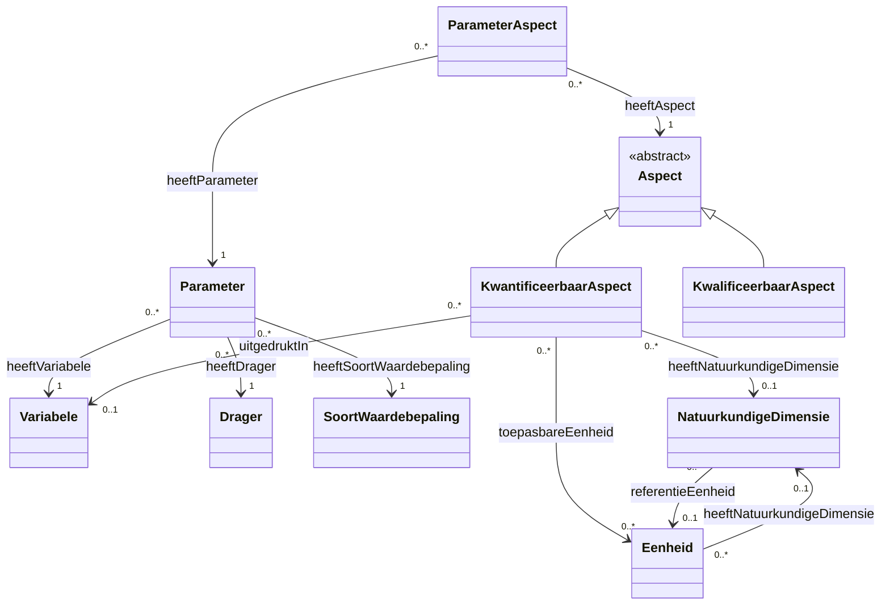

# Codelijsten Overzicht CSOR

## Abstract

Deze documentatie biedt een overzicht van de codelijsten die gezamenlijk worden beheerd in het CSO Register (CSOR). Het beschrijft de kernconcepten zoals dragers, variabelen, parameters en eenheden, evenals hun onderlinge relaties en beperkingen. De documentatie is bedoeld om inzicht te geven in de structuur en samenhang van de data, ondersteund door een gemeenschappelijke ontologie en visuele diagrammen.

## Gebruikte prefixen (namespaces)

Onderstaande tabel geeft een overzicht van de gebruikte prefixen en hun bijbehorende namespaces, zoals gedefinieerd in de projectcontext:

| Prefix | Namespace URI |
| :--- | :--- |
| **csor** | `https://data.omgeving.vlaanderen.be/ns/csor#` |
| **csor-constraints** | `https://data.omgeving.vlaanderen.be/ns/csor-constraints#` |
| **dc** | `http://purl.org/dc/elements/1.1/` |
| **dct** | `http://purl.org/dc/terms/` |
| **iadopt** | `https://w3id.org/iadopt/ont/` |
| **owl** | `http://www.w3.org/2002/07/owl#` |
| **prov** | `http://www.w3.org/ns/prov#` |
| **pubChem** | `https://pubchem.ncbi.nlm.nih.gov/rest/rdf/` |
| **qudt** | `http://qudt.org/schema/qudt/` |
| **rdf** | `http://www.w3.org/1999/02/22-rdf-syntax-ns#` |
| **rdfs** | `http://www.w3.org/2000/01/rdf-schema#` |
| **sh** | `http://www.w3.org/ns/shacl#` |
| **skos** | `http://www.w3.org/2004/02/skos/core#` |
| **xsd** | `http://www.w3.org/2001/XMLSchema#` |

## Globaal Overzicht

Onderstaand diagram toont de onderlinge relaties tussen de verschillende codelijsten:

## Codelijsten

Dit is een overzicht van de codelijsten die gezamenlijk beheerd worden in het cso register.

| Codelijst | Beschrijving | URI | Status |
| :--- | :--- | :--- | :--- |
| [Variabele](codelijsten/variabele.md) | Beschrijft waarover een uitspraak gebeurt. Een variabele is een kenmerk dat geobserveerd kan worden, los van de context waarin de obeservatie gebeurt, hoe de observatie gebeurt of hoe de waarde van de observatie wordt vastgelegd. | https://data.omgeving.vlaanderen.be/id/conceptscheme/csor/variabele | Gedocumenteerd |
| [Drager](codelijsten/drager.md) | Beschrijft een medium waarin een variabele geobserveerd kan worden. | https://data.omgeving.vlaanderen.be/id/conceptscheme/csor/drager | Gedocumenteerd |
| [Soortwaardebepaling](codelijsten/soortwaardebepaling.md) | Beschrijft de wijze waarop de observatie of waardebepaling van de variabele gebeurt. | https://data.omgeving.vlaanderen.be/id/conceptscheme/csor/soortwaardebepaling | Gedocumenteerd |
| [Parameter](codelijsten/parameter.md) | Een parameter specificeert een soort uitspraak over een variabele. Het koppelt een variabele aan een drager waarin de observatie gebeurt (drager) en de wijze waarop de observatie gebeurt (soort waardebepaling). Een parameter beschrijft meer specifiek waarover een uitspraak wordt gedaan d.m.v extra context en constraints. | https://data.omgeving.vlaanderen.be/id/conceptscheme/csor/parameter | Gedocumenteerd |
| [Parameter Aspect](codelijsten/parameteraspect.md) | Linkt een parameter aan een kwantificeerbaar of kwalificeerbaar aspect waarin de parameter uitgedrukt/vastgelegd kan worden. Het linkt een parameter aan een observeerbaar aspect waarin de waarde van de parameter kan vastgelegd worden. | https://data.omgeving.vlaanderen.be/id/conceptscheme/csor/parameteraspect | Gedocumenteerd |
| [Kwantificeerbaar Aspect](codelijsten/kwantificeerbaaraspect.md) | Een kwantificeerbaar aspect is een meetbaar aspect van een parameter met een numerieke waarde. Het duidt aan wat de interpretatie is van de numerieke waarde van een meting binnen een natuurkundige dimensie. | https://data.omgeving.vlaanderen.be/id/conceptscheme/csor/kwantificeerbaaraspect | Gedocumenteerd |
| [Kwalificeerbaar Aspect](codelijsten/kwalificeerbaaraspect.md) | Een kwalificeerbaar aspect is een observeerbaar aspect van een parameter met een niet numerieke waarde. | https://data.omgeving.vlaanderen.be/id/conceptscheme/csor/kwalificeerbaaraspect | Gedocumenteerd |
| [Natuurkundige Dimensie](codelijsten/natuurkundigedimensie.md) |  | https://data.omgeving.vlaanderen.be/id/conceptscheme/csor/natuurkundigedimensie | Gedocumenteerd |
| [Eenheid](codelijsten/eenheid.md) | Een maat waarin een natuurkundige dimensie of een kwantificeerbaar aspect numeriek kan worden uitgedrukt. | https://data.omgeving.vlaanderen.be/id/conceptscheme/csor/eenheid | Gedocumenteerd |

Binnen de lijst van Variabelen worden er een aantal groeperingen beheerd.

| Collectie | Beschrijving | URI | Status |
| :--- | :--- | :--- | :--- |
| [Chemische stof](codelijsten/variabele.md) |  | https://data.omgeving.vlaanderen.be/id/collection/csor/variabele/chemische_stoffen | Gedocumenteerd |
| [Goepsparameter](codelijsten/variabele.md) |  | https://data.omgeving.vlaanderen.be/id/collection/csor/variabele/bio_indicatoren | Gedocumenteerd |
| [Bioindicator](codelijsten/variabele.md) |  | https://data.omgeving.vlaanderen.be/id/collection/csor/variabele/groepsparameters | Gedocumenteerd |
| [Fysicochemische eigenschap](codelijsten/variabele.md) |  | https://data.omgeving.vlaanderen.be/id/collection/csor/variabele/fysische_eigenschappen | Gedocumenteerd |

## Gemeenschappelijke Ontologie

De overkoepelende ontologie die de relaties en restricties tussen deze codelijsten beschrijft, is te vinden in:
[csor_ontologie.ttl](ontologie/csor_ontologie.ttl)
