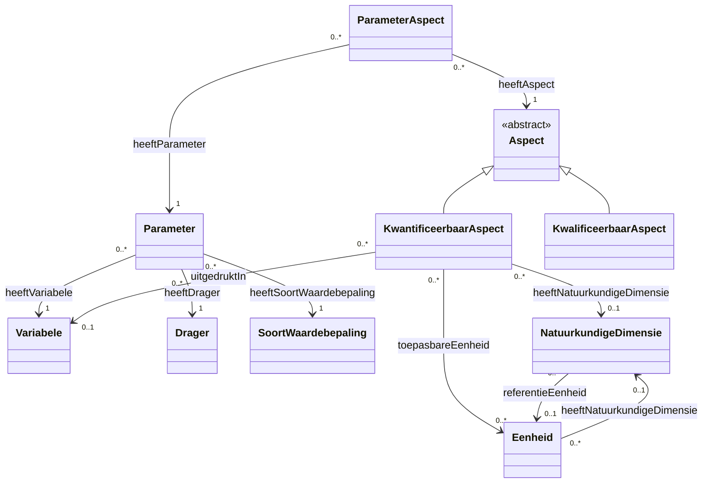

# Codelijsten Overzicht CSOR

## Abstract

Deze documentatie biedt een overzicht van de codelijsten die gezamenlijk worden beheerd in het CSO Register (CSOR). Het beschrijft de kernconcepten zoals dragers, variabelen, parameters en eenheden, evenals hun onderlinge relaties en beperkingen. De documentatie is bedoeld om inzicht te geven in de structuur en samenhang van de data, ondersteund door een gemeenschappelijke ontologie en visuele diagrammen.

## Gebruikte prefixen (namespaces)

Onderstaande tabel geeft een overzicht van de gebruikte prefixen en hun bijbehorende namespaces, zoals gedefinieerd in de projectcontext:

| Prefix | Namespace URI |
| :--- | :--- |
| **csor** | `https://data.omgeving.vlaanderen.be/ns/csor#` |
| **csor-constraints** | `https://data.omgeving.vlaanderen.be/ns/csor-constraints#` |
| **dc** | `http://purl.org/dc/elements/1.1/` |
| **dct** | `http://purl.org/dc/terms/` |
| **iadopt** | `https://w3id.org/iadopt/ont/` |
| **owl** | `http://www.w3.org/2002/07/owl#` |
| **prov** | `http://www.w3.org/ns/prov#` |
| **pubChem** | `https://pubchem.ncbi.nlm.nih.gov/rest/rdf/` |
| **qudt** | `http://qudt.org/schema/qudt/` |
| **rdf** | `http://www.w3.org/1999/02/22-rdf-syntax-ns#` |
| **rdfs** | `http://www.w3.org/2000/01/rdf-schema#` |
| **sh** | `http://www.w3.org/ns/shacl#` |
| **skos** | `http://www.w3.org/2004/02/skos/core#` |
| **xsd** | `http://www.w3.org/2001/XMLSchema#` |

## Globaal Overzicht

Onderstaand diagram toont de onderlinge relaties tussen de verschillende codelijsten:

## Codelijsten

Dit is een overzicht van de codelijsten die gezamenlijk beheerd worden in het cso register.

| Codelijst | Beschrijving | URI | Status |
| :--- | :--- | :--- | :--- |
| [Variabele](codelijsten/variabele.md) | Beschrijft waarover een observatie of uitspraak gebeurt. |  | Gedocumenteerd |
| [Drager](codelijsten/drager.md) | Beschrijft het medium waarin het kenmerk geobserveerd wordt. |  | Gedocumenteerd |
| [Soortwaardebepaling](codelijsten/soortwaardebepaling.md) | De wijze waarop de observatie of waardebepaling gebeurt. |  | Gedocumenteerd |
| [Parameter](codelijsten/parameter.md) | Koppelingspunt tussen variabele, drager en soortwaardebepaling. |  | Gedocumenteerd |
| [Parameter Aspect](codelijsten/parameteraspect.md) | Koppelingspunt tussen parameter en aspect. |  | Gedocumenteerd |
| [Kwantificeerbaar Aspect](codelijsten/kwantificeerbaaraspect.md) | Interpretatie van numerieke waarden van metingen. |  | Gedocumenteerd |
| [Kwalificeerbaar Aspect](codelijsten/kwalificeerbaaraspect.md) | Classificaties voor observaties. |  | Gedocumenteerd |
| [Natuurkundige Dimensie](codelijsten/natuurkundigedimensie.md) | De grootheid die gebruikt wordt voor de observatie. |  | Gedocumenteerd |
| [Eenheid](codelijsten/eenheid.md) | Maat waarin een dimensie wordt uitgedrukt. |  | Gedocumenteerd |

## Gemeenschappelijke Ontologie

De overkoepelende ontologie die de relaties en restricties tussen deze codelijsten beschrijft, is te vinden in:
[csor_ontologie.ttl](ontologie/csor_ontologie.ttl)
